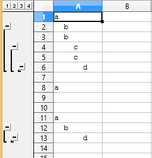

# group_indent
LibreOffice Calc Python macro for grouping rows according to their indentations.

Select the range you want to group,
<pre>
 selection area:     | indentation unit | range 
---------------------+------------------+--------------------------------------------
 1 row, 1 column     | character        | from selected row to whole sheet
 1 row, >1 columns   | cell             | from selected top left cell to whole sheet
 >1 row, 1 columns   | character        | selected rows
 >1 row, >1 columns  | cell             | selected range 
</pre>
and call group_select()

